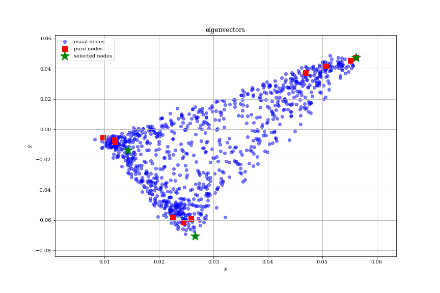

# SPOC

Research of overlapping community detection. 
We present improvements of existing algorithm successive projection
overlapping clustering ([SPOC][SPOC]). 


# Stucture of repository


* [Data][Data]
* [Experiments][Exps]
	* [Real data experiments][Exp1]
	* [Variable params][Exp2]
* [Figures][Figs]
* [Results][Results]
* [Algorithms][Algs]
	* [GeoNMF][GeoNMF]
	* [SPOC][ver1.0]
	* [MMSB model][]


[Data]:	 	https://github.com/stat-ml/SPOC/tree/master/data
[Exps]: 	https://github.com/stat-ml/SPOC/tree/master/experiments
[Exp1]: 	https://github.com/stat-ml/SPOC/tree/master/experiments/real_data
[Exp2]: 	https://github.com/stat-ml/SPOC/tree/master/experiments/params
[Figs]: 	https://github.com/stat-ml/SPOC/tree/master/figures
[Results]: 	https://github.com/stat-ml/SPOC/tree/master/results
[Algs]: 	https://github.com/stat-ml/SPOC/tree/master/spoc
[GeoNMF]:	https://github.com/stat-ml/SPOC/blob/master/spoc/GeoNMF.m
[ver1.0]:	https://github.com/stat-ml/SPOC/blob/master/spoc/spoc.py
[MMSB model]: https://github.com/stat-ml/SPOC/blob/master/spoc/generate_spoc_model.py
[SPOC]:		https://arxiv.org/abs/1707.01350
[SPOC++]:   https://404

```
Build status
```
**master**

[](https://dev.azure.com/stat-ml/spoc/_build/latest?definitionId=3&branchName=master)

**cmpatibility2021**

[](https://dev.azure.com/stat-ml/spoc/_build/latest?definitionId=3&branchName=compatibility_2021)

# Installation 

```commandline
git clone https://github.com/stat-ml/SPOC
cd SPOC
python setup.py install
```

# Quick Start

Check [example](examples/example.ipynb).



# Acknowledgment

The research was supported by the Russian Science Foundation grant (project 14-50-00150).
 The authors would like to thank Nikita Zhivotovskiy and Alexey Naumov 
 for very insightful discussions on matrix concentration. 
 The help of Emilie Kaufmann, who provided the code of SAAC algorithm, 
 is especially acknowledged.


# BibTex

```
@article{panov17,
    author = {Panov Maxim and Slavnov Konstantin and Ushakov Roman},
    title = {Consistent Estimation of Mixed Memberships with Successive Projections},
    journal = {COMPLEX NETWORKS 2017},
    year = {2017},
    url = {https://arxiv.org/abs/1707.01350},
}
```
